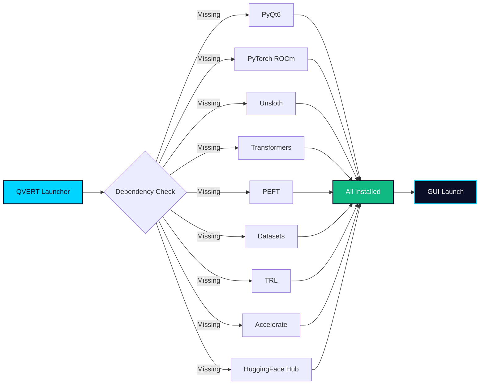

# QVERT-ROCm-RE-Trainer
  ││ ROCm RE Trainer v5.0 ││ True 1-Click Experience   

# QVERT || ROCm RE Trainer

<div align="center">


**True 1-Click ROCm LoRA Training for Reverse Engineering Tasks**

[Features](#-features) • [Workflow](#-workflow) • [Quick Start](#-quick-start) • [Documentation](#-documentation) • [Troubleshooting](#-troubleshooting)

</div>

---

## 📋 Overview

**QVERT ROCm RE** is a production-ready, single-file GUI application that automates the entire LoRA fine-tuning pipeline for reverse engineering AI models. Built specifically for AMD ROCm GPUs, it eliminates all manual configuration and dependency management.

### Primary Use Case

Train specialized AI assistants for **reverse engineering tasks** using the REx86 dataset (x86 assembly explanation generation). The trained model can:

- Analyze assembly code snippets
- Generate documentation/comments for binaries
- Explain shellcode behavior
- Assist with malware analysis
- Correlate CVE/CWE patterns

### Target Hardware

| GPU | VRAM | Support | Notes |
|-----|------|---------|-------|
| RX 7900 XTX/XT | 24GB | ✅ Official | Recommended (gfx1100) |
| RX 7800/7700 | 16-12GB | ✅ Official | Full support |
| RX 6900/6800 | 16GB | ⚠️ Unofficial | Requires gfx1030 override |
| Instinct MI300 | 192GB | ✅ Datacenter | Full support |

---

##  Features

###  True 1-Click Experience
- **Zero manual pip installs** - All dependencies auto-installed
- **3-layer fallback installation** - Handles permission issues automatically
- **Auto-restart after installs** - Fresh imports, no manual relaunch
- **ROCm version detection** - Automatically selects correct PyTorch index

###  Professional UI/UX
- **Dark Qvert theme** - Navy (#0a0e27) with cyan (#00d4ff) accents
- **6-step workflow chart** - Live status updates with visual indicators
- **Tabbed interface** - Trainer, Model Hub, Hardware Info
- **Real-time logging** - Timestamped console with status bar

###  Production Hardening
- **Atomic config saves** - No corruption on crash
- **Git versioning** - Automatic config snapshots with rollback
- **Backup/restore** - Config backup before every save
- **Retry logic** - 3 attempts per workflow step with backoff

###  ML Pipeline
- **Unsloth QLoRA** - 4-bit memory-efficient fine-tuning
- **ROCm env injection** - Proper GPU visibility before imports
- **Dual backend** - HIP (ROCm) or Vulkan inference
- **GGUF export** - Ready for llama.cpp offline deployment

### 🌐 Model Hub Integration
- **HuggingFace search** - Browse models without leaving app
- **Smart download** - Skip GGUFs for training (saves 100s of GBs)
- **One-click set base** - Apply downloaded model instantly

---

##  Workflow

### Visual Pipeline

```mermaid
flowchart TD
    Start([ Launch QVERT]) --> DepCheck{ Dependencies<br/>Installed?}
    
    DepCheck -->|No| AutoInstall[ Auto-Install<br/>PyTorch, Unsloth, etc.]
    AutoInstall --> Restart[ Clean Restart]
    Restart --> GUI[ Launch GUI]
    DepCheck -->|Yes| GUI
    
    GUI --> Step0[ Step 0: Setup]
    Step0 --> BuildLLama[Build llama.cpp<br/>HIP/Vulkan Backend]
    BuildLLama --> Step0Done{✅ Success?}
    Step0Done -->|Yes| Step1
    Step0Done -->|No| Retry0[Retry 2x]
    Retry0 --> Step0Done
    
    Step1[📊 Step 1: Prep] --> ConvertData[Convert REx86 JSON<br/>to Training Format]
    ConvertData --> Step1Done{✅ Success?}
    Step1Done -->|Yes| Step2
    Step1Done -->|No| Error1[x Log Error]
    
    Step2[ Step 2: Train] --> SetEnv[Set ROCm Env Vars<br/>HSA_OVERRIDE_GFX_VERSION<br/>HIP_VISIBLE_DEVICES]
    SetEnv --> LoadModel[Load Base Model<br/>Qwen2.5-Coder-7B]
    LoadModel --> TrainLoRA[Train LoRA Adapters<br/>QLoRA 4-bit]
    TrainLoRA --> Step2Done{✅ Success?}
    Step2Done -->|Yes| Step3
    Step2Done -->|No| OOM[o Reduce Batch Size]
    
    Step3[ Step 3: Merge] --> MergeAdapter[Merge LoRA + Base Model]
    MergeAdapter --> SaveModel[Save Merged Weights]
    SaveModel --> Step3Done{✅ Success?}
    Step3Done -->|Yes| Step4
    
    Step4[ Step 4: Export] --> ConvertGGUF[Convert to GGUF Format]
    ConvertGGUF --> Quantize[Quantize Q4_K_M]
    Quantize --> Step4Done{✅ Success?}
    Step4Done -->|Yes| Step5
    
    Step5[ Step 5: Infer] --> LoadGGUF[Load GGUF Model]
    LoadGGUF --> RunInference[Test on Sample Assembly]
    RunInference --> Output[Display Results]
    
    Output --> Complete([✅ Pipeline Complete])
    
    style Start fill:#00d4ff,stroke:#0a0e27,stroke-width:2px,color:#0a0e27
    style Complete fill:#10b981,stroke:#0a0e27,stroke-width:2px,color:#fff
    style Step0 fill:#1a2a4a,stroke:#00d4ff,stroke-width:2px,color:#fff
    style Step1 fill:#1a2a4a,stroke:#00d4ff,stroke-width:2px,color:#fff
    style Step2 fill:#1a2a4a,stroke:#00d4ff,stroke-width:2px,color:#fff
    style Step3 fill:#1a2a4a,stroke:#00d4ff,stroke-width:2px,color:#fff
    style Step4 fill:#1a2a4a,stroke:#00d4ff,stroke-width:2px,color:#fff
    style Step5 fill:#1a2a4a,stroke:#00d4ff,stroke-width:2px,color:#fff
    style AutoInstall fill:#f59e0b,stroke:#0a0e27,stroke-width:2px,color:#0a0e27
```



### Step Details

| Step | Action | Duration | Output | Key Operations |
|------|--------|----------|--------|----------------|
| **0. Setup** | Build llama.cpp | 5-15 min | `llama.cpp/build/bin/main` | Git clone, CMake, HIP/Vulkan compile |
| **1. Prep** | Convert dataset | <1 min | `dataset/re_dataset.jsonl` | JSON parsing, format conversion |
| **2. Train** | Fine-tune LoRA | 1-4 hours | `re_lora_adapter/` | ROCm env setup, Unsloth QLoRA, SFTTrainer |
| **3. Merge** | Merge weights | 5-10 min | `merged_re_model/` | PeftModel merge, unload adapters |
| **4. Export** | GGUF quantize | 5-10 min | `re_model_q4.gguf` | HF-to-GGUF convert, Q4_K_M quantize |
| **5. Infer** | Test inference | <1 min | Console output | llama.cpp main, HIP/Vulkan offload |

### Dependency Flow



---

##  System Requirements

| Component | Minimum | Recommended |
|-----------|---------|-------------|
| **OS** | Ubuntu 22.04 / Zorin 17 | Same |
| **GPU** | RX 6700 XT (12GB) | 2x RX 7900 XTX (48GB) |
| **ROCm** | 6.0+ | 6.2+ |
| **RAM** | 32GB | 64GB+ |
| **Storage** | 100GB free | 500GB+ NVMe |
| **Python** | 3.10+ | 3.12 |

### Pre-Installation Checklist

```bash
# Verify ROCm installation
rocminfo | grep "Name"

# Check GPU visibility
clinfo | grep "Device Name"

# Verify Python version
python3 --version  # Should be 3.10+
```

---

##  Quick Start

### 1-Click Launch

```bash
# Clone or download qvert_trainer.py
cd ~/your/project/path

# Create virtual environment (recommended)
python3 -m venv .venv
source .venv/bin/activate

# Run - everything else is automatic
python3 qvert_trainer.py
```

**That's it.** The application will:
1. Check all 9 dependencies
2. Auto-install missing packages (PyTorch-ROCm, Unsloth, etc.)
3. Restart cleanly after installation
4. Launch the GUI

### First Run Workflow

```
┌─────────────────────────────────────────────────────────────┐
│  DEPENDENCY CHECK - 9 packages to verify                    │
├─────────────────────────────────────────────────────────────┤
│  [✓] PyQt6              - Already installed                 │
│  [✓] PyTorch (ROCm)     - Already installed                 │
│  [✗] Unsloth (LoRA)     - Missing → Installing...           │
│  ...                                                          │
└─────────────────────────────────────────────────────────────┘

→ Auto-install completes in 10-30 minutes
→ Application restarts automatically
→ GUI launches ready for training
```

---

## Documentation

### Configuration Options

| Parameter | Default | Description |
|-----------|---------|-------------|
| `base_model` | `Qwen/Qwen2.5-Coder-7B-Instruct` | HuggingFace model ID |
| `batch_size` | `8` | Training batch size (adjust for VRAM) |
| `max_steps` | `600` | Training steps (~1 epoch for REx86) |
| `lr` | `2e-4` | Learning rate |
| `seq_len` | `8192` | Max sequence length |
| `inference_backend` | `HIP (ROCm)` | HIP or Vulkan |
| `dry_run` | `False` | Validate without execution |

### Config File Location

```
~/.qvert/qvert_config.json  # Auto-saved with Git versioning
```

### Project Structure

```
qvert_trainer.py          # Single-file application (this repo)
qvert_config.json         # Auto-generated configuration
qvert_config.json.backup  # Auto-backup before saves
.git/                     # Git versioning for configs
.venv/                    # Virtual environment (recommended)
llama.cpp/                # Auto-cloned during Setup step
dataset/                  # Prepared training data
re_lora_adapter/          # Trained LoRA weights
merged_re_model/          # Merged full model
re_model_q4.gguf          # Quantized inference model
```

---

##  Troubleshooting

### Common Issues

#### 1. "Unsloth cannot find any torch accelerator"
**Cause:** ROCm env vars not set before import  
**Fix:** Already handled automatically in v5.0 - ensure you're using latest code

#### 2. PyQt6 import failed
```bash
pip uninstall PyQt6
pip install PyQt6 --force-reinstall
```

#### 3. Out of memory during training
Reduce `batch_size` in config:
```json
"batch_size": 4,
"gradient_accumulation_steps": 4
```

#### 4. llama.cpp build fails
```bash
# Clean and rebuild
rm -rf ./llama.cpp
# Click "0. Setup" again in GUI
```

#### 5. ROCm not detected
```bash
# Verify ROCm installation
/opt/rocm/bin/rocminfo

# Set override if needed
export HSA_OVERRIDE_GFX_VERSION=11.0.0
```

### Log Locations

| Log Type | Location |
|----------|----------|
| **Application** | GUI console (bottom panel) |
| **Training** | `re_lora_adapter/trainer_log.txt` |
| **Config** | `qvert_config.json` + Git history |

---

##  Advanced Usage

### Custom Datasets

1. Place JSON files in `./REx86/` directory
2. Format must match:
```json
[
  {
    "instruction": "Analyze this assembly...",
    "input": "xor %eax, %eax\n...",
    "output": "This zeroes the eax register..."
  }
]
```
3. Click "1. Prep" to process

### Push to HuggingFace

After training:
```python
from huggingface_hub import HfApi
api = HfApi()
api.upload_folder(folder_path="./merged_re_model", repo_id="your-username/your-model")
```

### CLI Mode (Fallback)

If GUI fails, the application provides CLI fallback with basic commands for each workflow step.

---

##  License

MIT License - See LICENSE file for details

---

##  Contributing

1. Fork the repository
2. Create feature branch (`git checkout -b feature/amazing-feature`)
3. Commit changes (`git commit -m 'Add amazing feature'`)
4. Push to branch (`git push origin feature/amazing-feature`)
5. Open Pull Request

---

##  Support

| Issue Type | Channel |
|------------|---------|
| Bug Reports | GitHub Issues |
| Feature Requests | GitHub Discussions |
| ROCm Compatibility | GitHub Issues (include `rocminfo` output) |

---

<div align="center">

**Built with ❤️ for AI Engineering community | Train Models on AMD Hardware with ease..**

[Report Bug](https://github.com/qvert/qvert-trainer/issues) • [Request Feature](https://github.com/qvert/qvert-trainer/discussions)

</div>
